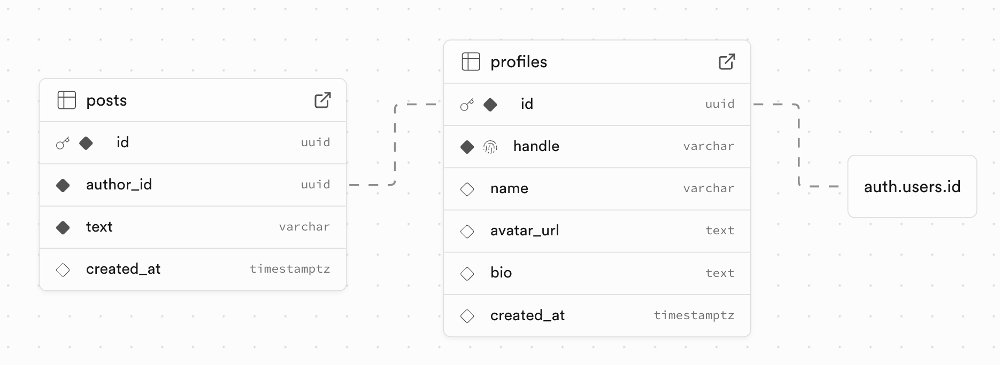

# Zellerfeld assessment - X/Twitter Clone

A simple Twitter-like social media app built using Next.js, TypeScript, and Supabase.

## Features / Requirements

**User Profiles:**

- This view should show basic information
  - [x] username
  - [x] profile picture placeholder, etc.
    - [x]  Personal challenge, if time permits add gravatar support
  - [x]  and display a feed of posts associated with that profile.

**Feed:**

- Implement a feed that lists posts. Posts can be simple texts (consider a character limit, e.g., 280 characters).
  - Took the liberty of making this a real-time feed that shows posts in reverse chronological order easily thanks to Supabase

**Post Creation**

- Allow users to create new posts via the UI.
  - Create posts with 280-character limit

**Pagination** 

- Load more posts with pagination

**Authentication** 

- Magic link authentication with Supabase

**Responsive Design**

- Did my best to keep it responsive (main reason I chose to use Tailwinds and not just do my own styles / aside from speed)

## Tech Stack used

> This is the stack I've decided to use, most of the stack decisions come from languages and frameworks I'm comfortable with or thought would be the right choice for the amount of time I was asked to take for this exercise (4-6hr).

- **Frontend**: Next.js 15, TypeScript, Tailwind CSS
- **Backend**: Next.js API Routes
- **Database**: Supabase
- **Authentication**: Leveraged Supabase Auth
- **Deployment**: Vercel for simplicity

## Getting Started

### Prerequisites

- Node.js 18+ 
- Supabase account

### Installation

1. Clone the repository
```bash
git clone git@github.com:highvoltag3/x-clonezf.git
cd x-clonezf
```

2. Install dependencies
```bash
npm install
```

3. Set up Supabase
   - Create a new Supabase project -> `https://supabase.com/`
   - Run the SQL schema from `supabase-schema.sql` in the Supabase SQL editor (it's in the project root)
   - Get the project URL and anon key from Settings > API

4. Configure environment variables

```bash
touch .env.local
```

Update `.env.local` with the Supabase credentials:
```
NEXT_PUBLIC_SUPABASE_URL=your_supabase_project_url
NEXT_PUBLIC_SUPABASE_ANON_KEY=your_supabase_anon_key
```

5. Run the development server

```bash
npm run dev
```

Open [http://localhost:3000](http://localhost:3000) in your browser.

## Data model


See `/lib/supabase.ts` for the schema and trigger function.

## API Endpoints

### Profile

- `GET /api/profile/[handle]` - Get user profile by handle
- `GET /api/profile/[handle]/posts` - Get user's posts with pagination

### Posts

- Post creation is handled client-side using Supabase's built-in authentication and RLS policies

### Query Parameters

- `limit` - Number of posts to return (default: 10)
- `offset` - Number of posts to skip (default: 0)

## Database Schema

### Profiles Table

- `id` - UUID (references auth.users)
- `handle` - Unique username
- `name` - Display name
- `avatar_url` - Profile picture URL
- `bio` - User bio
- `created_at` - Timestamp

### Posts Table

- `id` - UUID
- `author_id` - UUID (references profiles)
- `text` - Post content (max 280 chars)
- `created_at` - Timestamp

## Architecture

### High-level System Architecture


- **Frontend**: Next.js App Router with TypeScript
- **API**: Next.js API routes with Supabase client
- **Database**: PostgreSQL with Row Level Security (RLS)
- **Auth**: Supabase magic link authentication
- **Styling**: Tailwind CSS with responsive design

## Development Notes

- Posts are limited to 280 characters (enforced client and server-side)
- Pagination uses offset-based approach for simplicity
- Authentication uses Supabase's built-in client-side authentication with RLS policies
- RLS policies ensure users can only modify their own content

## What I would do differently if I had more time

**Feature**

- Change/Customize username

### Architecture & Code Quality

**State Management**

- I'd implement a proper state management solution like Redux for the global feed state
- Currently I am using window.location.reload() which is inefficient but had to be pragmatic due to time constraints

**Component Architecture**

- I'd extract more reusable components - the post card is duplicated between feed and profile pages
- I'd add proper error boundaries and loading states with skeleton components
- Implement a proper modal system with focus management and keyboard navigation

### Performance & UX

**Performance Optimizations**

- Add React Query or SWR for better data fetching, caching, and background updates
- Implement virtual scrolling for the feed since it could get very long if this was a real-world thing
- Would add image optimization and lazy loading for avatars, aside from implementing upload avatar rather than relaying on Gravatar

**Real-time Features**

- I'd add WebSocket connections for real-time post updates instead of page refreshes
- Would implement optimistic UI updates so posts appear instantly

**DX, Security and others**

- I would add better type definitions
- Tests and testing framework (Jest maybe) and proper CI/CD pipeline with automated testing"
- I'd set up proper ESLint/Prettier configuration
- Ensure proper input sanitization and XSS protection
- Add rate limiting and proper authentication flows + other auth services -- which supabase makes easy but didn't want to waste extra time after I went on a rabit hole to fix my Supabase integration